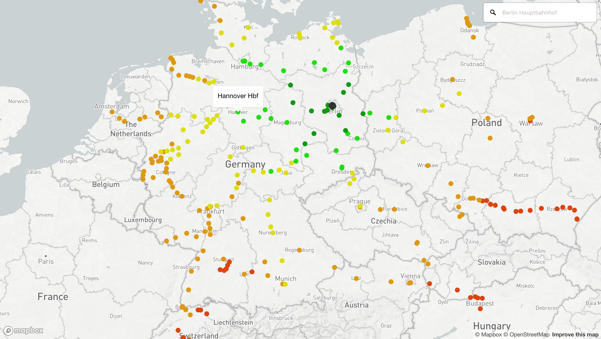

# direkt.bahn.guru

**[direkt.bahn.guru](https://direkt.bahn.guru/)** All direct long-distance railway connections from a given city.

## See also

- [bahn.guru](https://github.com/juliuste/bahn.guru) - Find the cheapest Deutsche Bahn "Sparpreise" (low-cost tickets) for the next month.
- [pricemap.eu](https://github.com/juliuste/travel-price-map) - Map of cheapest railway and bus (coach) travel prices between several european cities.

## Contributing

If you found a bug or want to propose a feature, feel free to visit [the issues page](https://github.com/juliuste/direkt.bahn.guru/issues).
